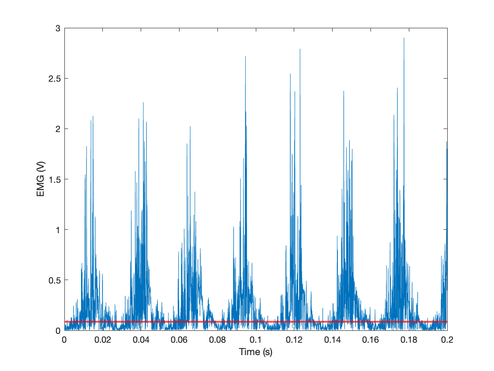

This function determines the threshold that best discriminates between signal and noise in a measured EMG signal. It is an implementation of the method desribed in 
[Thexton, A.J., 1996.](https://www.sciencedirect.com/science/article/abs/pii/0165027096000040) A randomisation method for discriminating between signal and noise in recordings of rhythmic electromyographic activity. Journal of neuroscience methods, 66(2), pp.93-98.

# Example
Full wave rectified surface EMG signal from the abductor hallucis muscle of a human running at 0.77 Fr, recorded at 2000 Hz. The noise discriminating threshold found by the code is in red. 