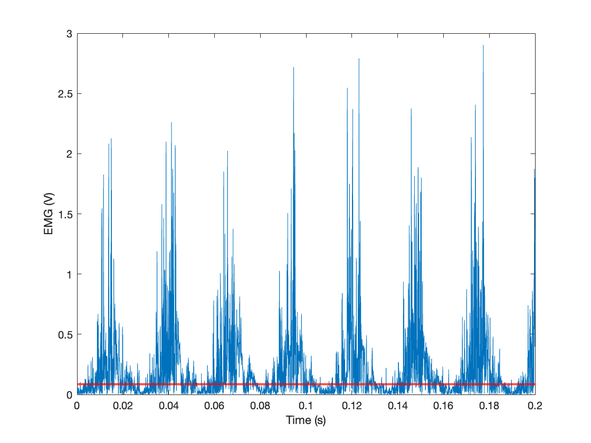
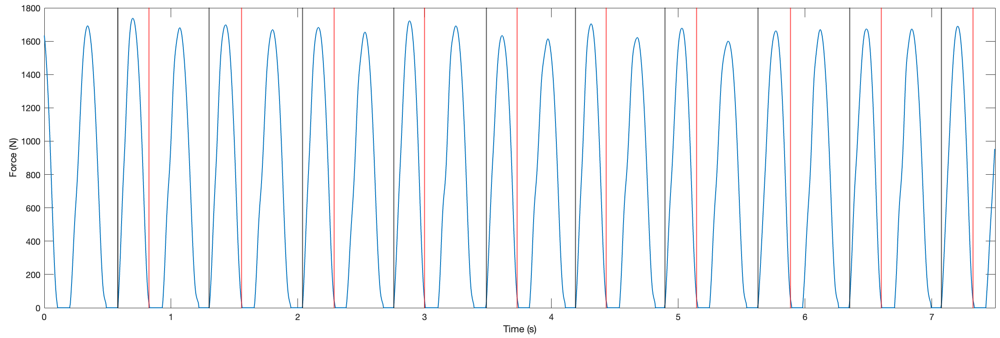
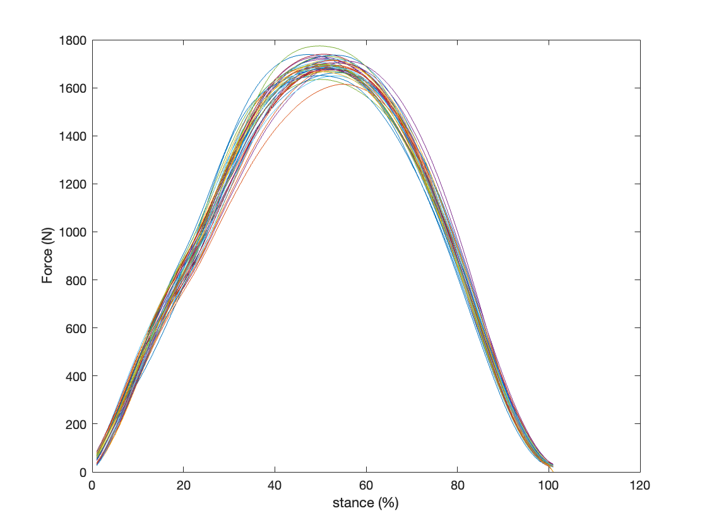

This repository is a collection of MATLAB functions commonly used in locomotion biomechanics data analyses. In the near future, I will add Python versions of each function. **This is a work in progress, please note that these functions may still be buggy.**

- [Thexton EMG thresholding](#thexton-emg-thresholding)
- [Gait event detection in single-belt running](#gait-event-detection-in-single-belt-running)
- [Ensemble averaging of gait data](#ensemble-averaging-of-gait-data)

## [Thexton EMG thresholding](thexton)

This function determines the threshold that best discriminates between signal and noise in a measured EMG signal. It is an implementation of the method desribed in 
[Thexton, A.J., 1996.](https://www.sciencedirect.com/science/article/abs/pii/0165027096000040) _A randomisation method for discriminating between signal and noise in recordings of rhythmic electromyographic activity. Journal of neuroscience methods, 66(2), pp.93-98._

### Example
Full wave rectified surface EMG signal from the abductor hallucis muscle of a human running at 0.77 Fr, recorded at 2000 Hz. The noise discriminating threshold found by the code is in red.

## [Gait event detection in single-belt running](runningEvents)
Detecting foot strike events in running is non trivial when using a single force plate, such as in a single belt treadmill, because the force plate cannot distinguish between ipsi- and contralateral foot strikes. This function uses force data and kinematic data from one marker on the foot and returns heel strike and toe off events. 

### Example
coming soon!

## [Ensemble averaging of gait data](ensembleAverage)
This function splits up continuous locomotion data (Kinetics, Kinematics, EMG etc.) into chunks between user provided heel strike and toe off events, normalizes each step to 100 points, and calculates the mean data over all steps. Events can be specified in seconds from the start of the time series or as frame numbers.

### Example
Figure 1 shows a subset of the vertical ground reaction force data from a human running at 0.77 Fr for 30s, recorded at 2000Hz, and low pass filtered with a cutoff frequency of 25 Hz. Event instances are marked with black vertical bars for **touch down** and red for **toe off**.

Figure 2 shows the output of `ensembleAverage.m` results in data chopped up between event pairs and normalized to stance percent. From here, the mean and variance can be calculated across all steps. Each color is an individual step.

